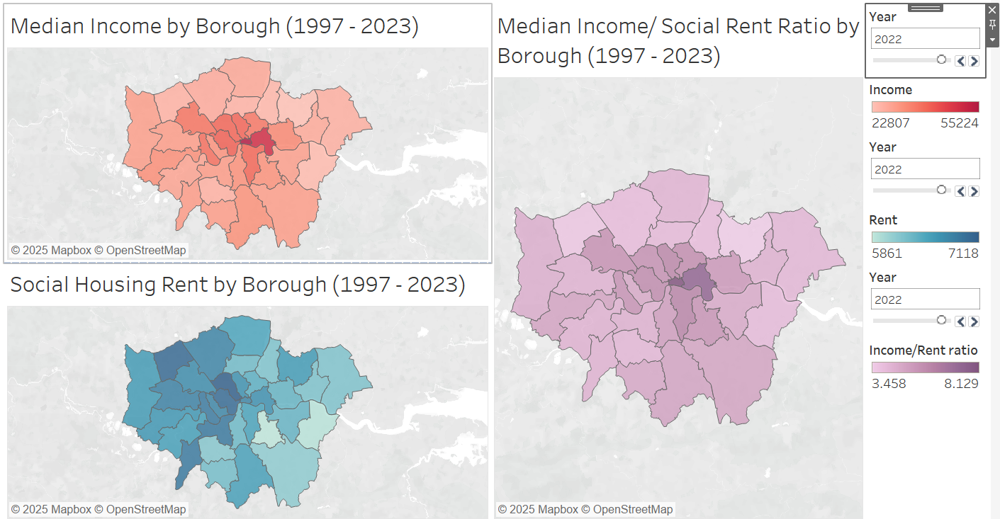
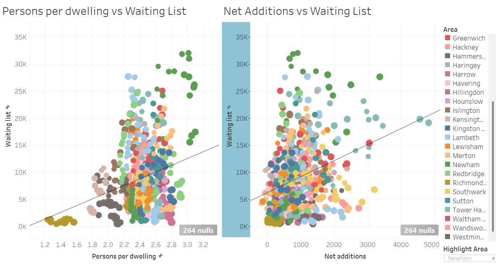
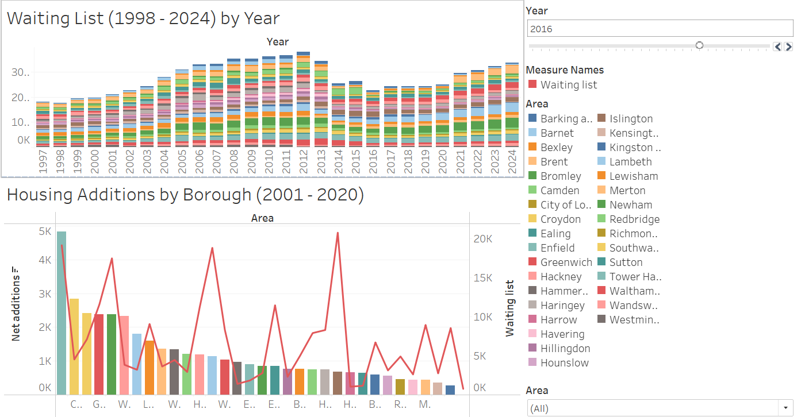
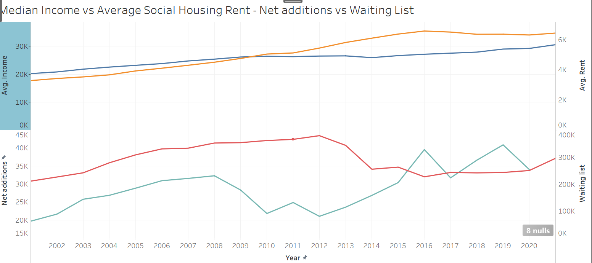
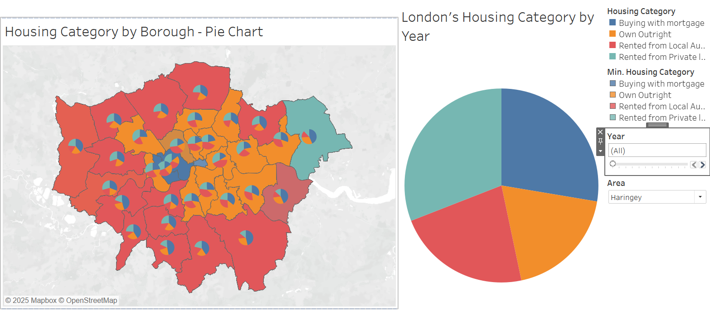
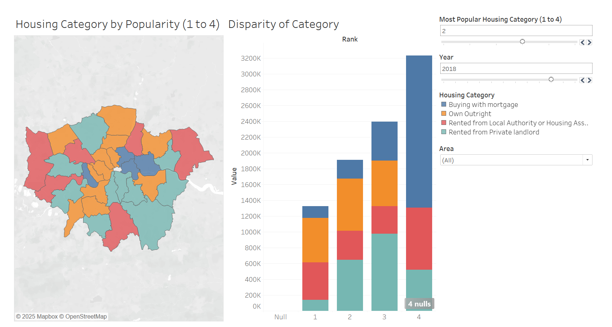
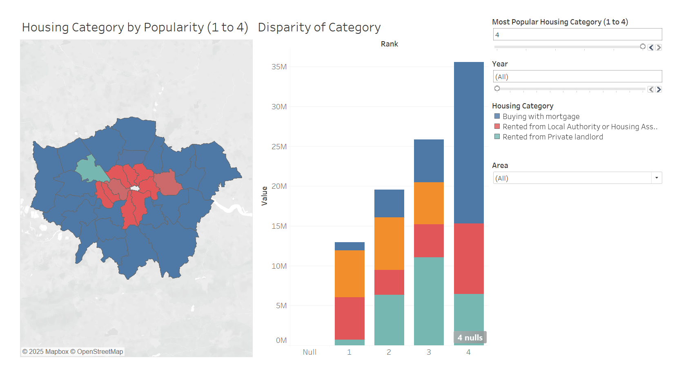
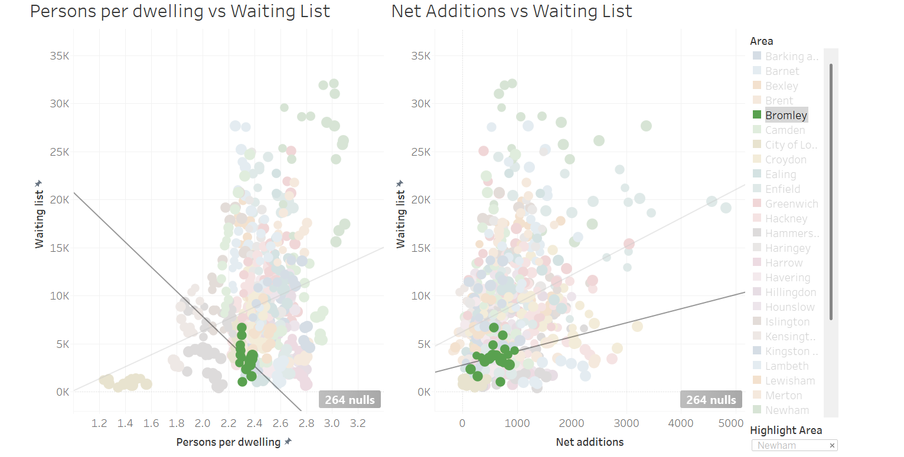
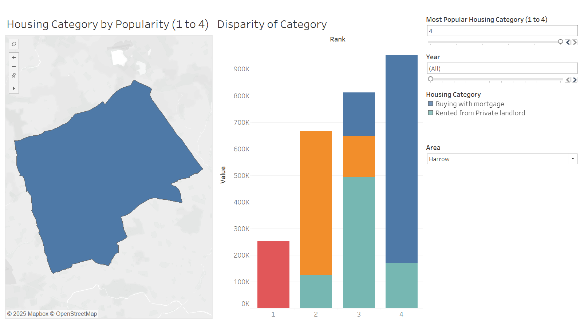
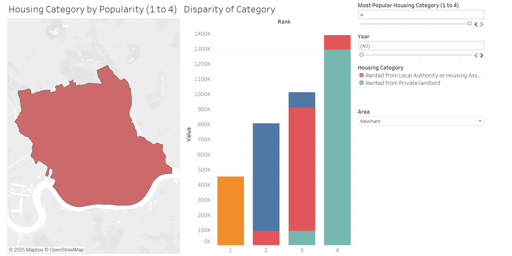

# London Calls Forwarded - Housing Analysis 

London Calls Forwarded is a dashboard that aims to identify patterns in London's Housing. Understanding how London's Housing Market has evolved in the last 2 decades in a Borough level with the following factors :
* Median Income
* Social Housing Rent
* Net Additions
* Social Housing Waiting Lists
* Persons Per Dwelling
* Tenure Analysis - Buying With Mortgage, Own Outright, Rented from Local Authority, and Rented from Private Authority.

[London Calls Forwarded - Housing Market Anlaysis](https://x.com/agraybee/status/1909266463279440223)

# Genesis - Selling London by the House

On the seventh of April, a user called named agraybee posted on X the following: 

[Tweet](https://x.com/agraybee/status/1909266463279440223)

With 6.4M views, 3700 reposts & 93,000 likes. A viral post sparking curiosity, indicating there's a large audience with an interest in Economic/Policy related issues that are directly impacted by the prices with the current state of the global trade. Further supported by the Author's username.

# Beatles - Data Roads
The Data utilized in London Calls Forwarded comes from [London Housing Data](https://data.london.gov.uk/housing).

London's Borough Shapefiles were extracted from
[GIS Boundary Files London](https://data.london.gov.uk/dataset/statistical-gis-boundary-files-london).

# PythonScripts - Just Another Brick in London's Housing Wall
1) Rent.py - Cleans London's Social Housing Weekly Rent Data by Borough from 1997 to 2003.
2) Income.py - Cleans through London's Median Income Data by Borough from 1997 to 2024.
3) Waiting_list.py - Cleans through London's Social Housing Waiting List Data by Borough from 1998 to 2024. 
4) NetAdditionsPersonspDwelling.py - Loops through net-additional-dwellings-total-stock-borough.xlsx, to clean and create Net Additions & Persons Per Dwelling Data by Borough from 2001 to 2024.
5) TenureAnalysis.py - Loops through the sheets of tenure-population-borough.xlsx to identify London's Housing Cateorgy by Borough - Buying With Mortgage, Own Outright, Rented from Local Authority, and Rented from Private Authority. 
6) Pattymelt.py - Utilizes a 'Mega-Melt' function to melt Rent, Income, Waiting List, Net Additions, and Persons Per Dwelling to create pattymelt.csv which contains values of all the variables as columns. Additionally, Rent/Income is also created.
7) combine-shp.py - Merges & Dissolves all of London's Boroughshape files and merges with pattymelt.csv to create London_Borough_LSOA_All_Variables.geojson which is further utilized in Tableau for visualization.

# The Rolling Tabs - Housing Diamonds 

## 1) Income/Rent Analysis   
*Graph 1* - Median Income by Borough

*Graph 2* - Social Housing Rent by Borough

*Graph 3* - Median Income / Social Housing Rent by Borough

## 2) Waiting List Analysis 

*Graph 1* - Scatter Plot of Persons per Dwelling and Waiting Lists 

*Graph 2* - Scatter Plot of Net Additions and Waiting Lists 
## 3) Housing Additions & Waiting List by Year 

*Graph 1* - Bar Chart to see the pattern of Net Addition by Borough by Year

*Graph 2* - Highest Net additions by Borough by Year

## 4) Median Income vs Average Social Housing Rent 

*Graph 1* - Line Chart of Median Income vs Social Housing Rent

*Grpah 2* - Line Chart of Total Net additions vs Waiting List 

## 5) Housing Category Overview

*Graph 1* - Map with Pie Chart of Housing Category %

*Graph 2* - Interactive Housing Category Pie Chart 

## 6) Housing Category by Popularity

*Graph 1* - Interactive Map of Popular Housing Category (1 to 4) by Borough 

*Graph 2* - Bar Chart of Popular Housing Category 

# Talk Talk - Final Thoughts

Social Housing remains a large component of Central London's Housing Market. While Purchasing with Mortgage appears to be the popular option for outter boroughs.

For Exterior Boroughs that have limited Net Additions, as identified on Graph - 2. We notice that the amount of people Renting from Local Authority continues to remain low, while they remain prime Boroughs for House Ownership or Buying with Mortgage over the years. 

Additionally, Central London shows different trends. Boroughs such as Newham, Tower Hamlets where there's a great need for Housing. Renting from Local Authority went from being the most popular to 3rd most popular option. Indicating, possible Trends in the Housing Market.

